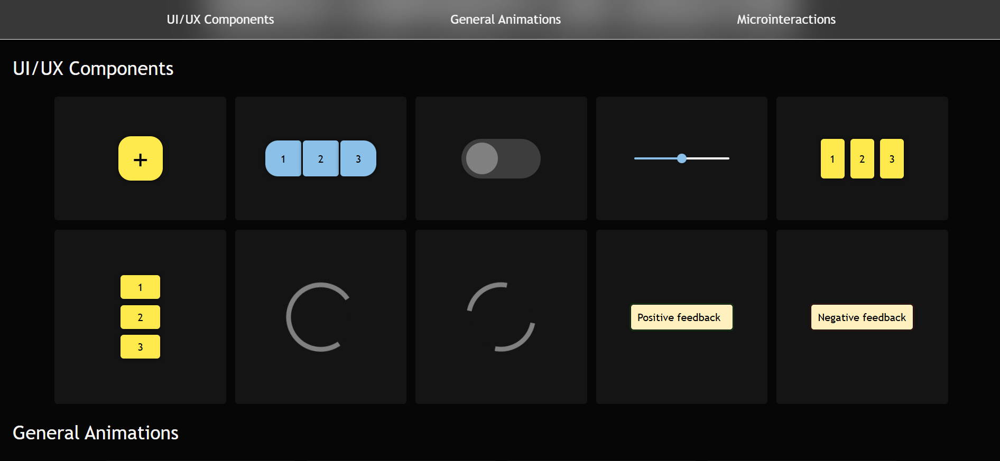
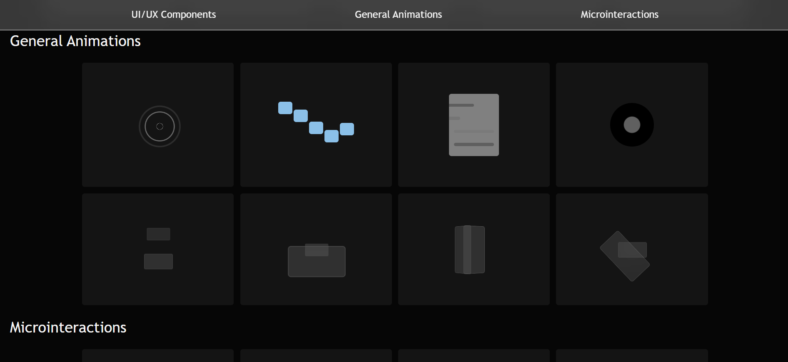

# Various UI/UX Components and Animations



A compact, fully responsive site showcasing various UI/UX components and animations.

## Table Of Contents
1. [Installation](#installation)
2. [Usage](#usage)
3. [Tech Stack](#tech-stack)
4. [Project Structure](#project-structure)
5. [Author](#author)
6. [License](#license)

## Installation
Copy this repository's link: 
```
https://github.com/logicalPanda2/animations-and-components.git
```
Then, in Git Bash, navigate to the directory you want the cloned directory to be in:
```
$ cd example_directory
```
Then, type in the command `git clone` along with the copied link:
```
$ git clone https://github.com/logicalPanda2/animations-and-components.git
```
Wait until all processes are done, indicating the repository is successfully cloned.

## Usage
Navigate to the main.html file in the `src` folder, then open it directly in your browser.

## Tech Stack
- HTML5
- CSS3 (Flexbox)
- JavaScript (ES6)

## Project Structure
```
/various-animations (root)
    /images (contains screenshots of final website)
    /src 
        /scripts
        /styles
        main.html
LICENSE.txt
README.md
```

## Author
Marcelino Romeo @logicalPanda2 (https://github.com/logicalPanda2)

## License
This project is licensed under the <a href="LICENSE.txt">MIT</a> License.